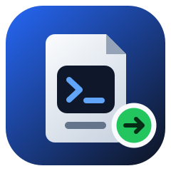

<div align="center">



# DeepSeek Harness Portable

### *Your complete AI coding workspace—portable across Windows, Linux, and macOS.*

Run the official DeepSeek Harness from one self-contained folder on an internal disk, USB drive, or external SSD. Your runtimes stay isolated by operating system while chats, settings, skills, plugins, and credentials travel with you.

[](https://github.com/techjarves/Deepseek-Harness-Portable/releases/latest)
[](#supported-platforms)
[](#supported-platforms)
[](https://github.com/techjarves/Deepseek-Harness-Portable/actions/workflows/test.yml)
[](https://github.com/techjarves/Deepseek-Harness-Portable/actions/workflows/auto-update.yml)
[](https://youtu.be/nyTJ-1sqkVU)

[**Download latest release**](https://github.com/techjarves/Deepseek-Harness-Portable/releases/latest/download/deepseek-harness-portable.zip) · [**Watch walkthrough**](https://youtu.be/nyTJ-1sqkVU) · [**Quick start**](#quick-start) · [**How portability works**](#how-portability-works) · [**Troubleshooting**](#troubleshooting)

</div>

---

<div align="center">

## Video walkthrough

<a href="https://youtu.be/nyTJ-1sqkVU">
  
</a>

**[▶ Watch the complete walkthrough on YouTube](https://youtu.be/nyTJ-1sqkVU)**

</div>

---

## Why this project?

DeepSeek Harness normally depends on a local Node.js environment and stores host-specific paths. This project wraps the official Harness distribution with a portable bootstrap that keeps installation, updates, runtime dependencies, and cross-platform session migration inside one folder.

| | Capability | What it means |
| --- | --- | --- |
| 🚀 | **One-command startup** | Run the launcher for your operating system to open the local web interface. |
| 💾 | **One movable folder** | Use an internal drive, USB drive, external SSD, or an exFAT volume. |
| 🧩 | **No global runtime required** | Portable Node.js, pnpm, native packages, and caches remain inside the folder. |
| 🖥️ | **Lazy platform setup** | Only the runtime for the operating system currently in use is downloaded. |
| 💬 | **Cross-platform chats** | Workspace paths and compressed session headers are migrated when the folder changes operating systems. |
| 🔄 | **Tested automatic updates** | Updates are installed only after the release passes the supported-platform test matrix. |
| 🧹 | **Recoverable reset** | Remove mutable application data while preserving models and reinstall essentials. |

## Supported platforms

| Operating system | Architecture | Baseline | Launcher |
| --- | --- | --- | --- |
| Windows 10/11 | x64 | 64-bit desktop Windows | `windows.bat` |
| Linux | x64 | glibc; Ubuntu 22.04 compatible | `linux.sh` |
| macOS | Apple Silicon | arm64 | `mac.sh` |

> [!NOTE]
> Windows ARM64, Linux ARM64, Intel macOS, and musl-based Linux distributions are not supported in version 1.

## Quick start

Download [`deepseek-harness-portable.zip`](https://github.com/techjarves/Deepseek-Harness-Portable/releases/latest/download/deepseek-harness-portable.zip), extract it, and run the launcher for the current operating system.

### Windows

```bat
windows.bat setup
windows.bat
```

### Linux

```sh
sh linux.sh setup
sh linux.sh
```

### macOS

```sh
sh mac.sh setup
sh mac.sh
```

The first command initializes or repairs only the current platform. The second starts the local DeepSeek Harness web interface and opens it in your normal browser, typically at `http://127.0.0.1:3080`.

> [!TIP]
> Setup is optional on first launch. Running the launcher directly also installs the current platform when its runtime is missing.

## Launcher commands

Every launcher exposes the same interface:

| Command | Purpose |
| --- | --- |
| `<launcher>` | Start the web interface. |
| `<launcher> setup` | Install or repair the current platform only. |
| `<launcher> doctor` | Verify the architecture, runtime, portable layout, and Harness installation. |
| `<launcher> portable-update` | Force an immediate check for the latest tested manifest. |
| `<launcher> -- <arguments>` | Pass arguments directly to the official `dsh` CLI. |

Examples:

```sh
sh mac.sh doctor
sh linux.sh portable-update
sh mac.sh -- --profile headless "summarize this project"
```

```bat
windows.bat doctor
windows.bat -- --help
```

## How portability works

### Platform isolation

Each operating system receives a separate runtime and cache. Initializing macOS never downloads Windows or Linux assets; those are added only when their launcher runs.

```text
Deepseek-Harness-Portable/
├── windows.bat
├── linux.sh
├── mac.sh
├── data/          shared Harness home, sessions and settings
├── models/        preserved model files
├── runtimes/      isolated windows-x64, linux-x64 and macos-arm64 runtimes
├── packages/      downloads and package-manager caches
├── scripts/       bootstrap, migration, diagnostics and reset logic
├── state/         per-platform installation state
├── logs/          portable launcher logs
└── temp/          staging and temporary files
```

The repository root intentionally contains only the three launchers. Everything else is organized by function.

### Shared chats and workspaces

DeepSeek Harness stores absolute workspace paths inside its registry, projection cache, session directory names, and compressed chat headers. Those paths are different on Windows, Linux, and macOS.

Before Harness starts, the portable launcher:

1. Detects paths belonging to another operating system.
2. Relocates workspaces that live inside the portable folder.
3. Rewrites only the session-header frame while preserving every compressed chat event.
4. Moves the session to the correct operating-system-specific directory key.
5. Synchronizes the workspace registry and projection cache.
6. Keeps an untouched backup before rewriting a session log.

If an external project is unavailable on the current computer, its chat history is attached to a fallback under `data/portable-workspaces/` so the conversation remains viewable. To edit the same project everywhere, keep its project files inside that portable workspace as well.

### Safe installation and relocation

- Downloads are written to staging locations and checked with SHA-256 before promotion.
- An interrupted installation does not replace the previous working runtime.
- Symlinks are avoided for exFAT compatibility.
- Spaces and Unicode characters in the folder path are supported.
- Moving or renaming the folder does not change system configuration.
- Browsers are launched with the host user environment, preventing portable paths from interfering with the macOS Keychain or browser profile.

## Automatic updates

Installed copies check for a tested portable release at most once every 24 hours. Network or update failures leave the current runtime active.

The repository automation checks the DeepSeek Harness npm update channel once per day. A candidate is published only after it:

1. Generates an exact dependency lock.
2. Runs the vulnerability audit.
3. Performs clean installations on every supported platform.
4. Runs contract, doctor, CLI, session-portability, and smoke tests.
5. Publishes the release archive, checksums, and build provenance.

Disable launcher-side update checks in a controlled environment with:

```sh
export DSH_PORTABLE_NO_AUTO_UPDATE=1
```

## Reset

Reset removes runtimes, sessions, settings, credentials, caches, downloads, logs, temporary files, and installation state. It preserves `models/`, the immutable launchers, reset tools, bootstrap logic, and signed manifests required to reinstall.

```bat
scripts\reset.bat
```

```sh
sh scripts/reset.sh
```

Both reset implementations require confirmation before removing portable data.

## Security and credentials

> [!WARNING]
> Credentials stored by DeepSeek Harness travel inside the portable folder in plaintext. exFAT cannot provide dependable per-user file permissions. Treat the drive and its backups as sensitive.

- Keep the drive physically secure.
- Use provider keys with budgets or spending limits.
- Never publish a fully initialized test archive containing `data/`.
- Do not commit `data/`, `state/`, `runtimes/`, caches, or model files.
- Revoke any credential that has been exposed in a terminal recording, screenshot, chat, or public repository.
- Verify public downloads with the release `SHA256SUMS` file and GitHub build provenance.

Cloud models still require network access and valid provider credentials. After initialization, the Harness core can start offline, but cloud inference and optional downloads cannot.

## Troubleshooting

| Symptom | Resolution |
| --- | --- |
| `Could not resolve host: nodejs.org` | Check DNS or network connectivity and run the launcher again. Completed downloads are reused. |
| Credential file reports mode `664` | Run the latest launcher. It automatically repairs the file to owner-only permissions on macOS and Linux. |
| A Windows chat is missing on macOS or Linux | Expand its workspace row. The launcher migrates the chat index and compressed session header at startup. |
| An external project opens as an empty fallback | Copy the project into its directory under `data/portable-workspaces/`, or add its local path as a workspace on that computer. |
| Chrome shows a macOS Keychain warning | Update to the latest portable release. Current launchers open browsers with the host user environment. Do not reset the Keychain. |
| Linux reports a `noexec` mount | Remount the external drive with execution enabled, then rerun `doctor`. |

For deeper diagnostics, run the platform launcher with `doctor` and review `data/dsh-home/logs/`.

## Testing

Every source change is tested through GitHub Actions on:

- Windows Server 2022 x64
- Ubuntu 22.04 x64
- Ubuntu 24.04 x64
- Apple Silicon macOS

The suite covers manifest integrity, clean installation, launcher behavior, runtime isolation, checksum validation, chat-path migration, multi-frame Zstandard history preservation, and CLI startup.

[View the cross-platform test history →](https://github.com/techjarves/Deepseek-Harness-Portable/actions/workflows/test.yml)

## Upstream project

This project packages the official [`@deepseek-ai/dsh`](https://www.npmjs.com/package/@deepseek-ai/dsh) distribution. DeepSeek Harness itself is maintained in [`deepseek-ai/deepseek-harness`](https://github.com/deepseek-ai/deepseek-harness).

This repository is an independent portability layer and is not the upstream DeepSeek Harness project.

---

<div align="center">

**One folder. Three operating systems. Your Harness workspace everywhere.**

[Download](https://github.com/techjarves/Deepseek-Harness-Portable/releases/latest) · [Report an issue](https://github.com/techjarves/Deepseek-Harness-Portable/issues) · [View releases](https://github.com/techjarves/Deepseek-Harness-Portable/releases)

</div>
